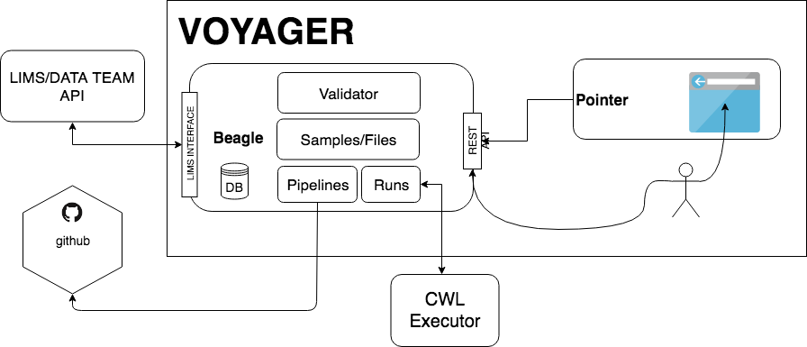

# Pointer

Frontend application - Voyager project

## Pages

- Pages:
  - Login
  - Files
  - File Details
  - Runs
  - Create Run
  - File Picker
  - Outputs

## Setup

Install NodeJS and NPM from https://nodejs.org/en/download/.
Clone repository and cd into the pointer directory.
Install all required npm packages by running `npm install`.
Add Temporary Environmental Variable:

For development run:

`npm start`

Go to http://localhost:8080 in your browser.

Read more detailed specification on [wiki page](https://github.com/mskcc/pointer/wiki/Pointer).
